# Tugas Pemrograman Jaringan 10
## Dokumentasi

### Tabel Hasil Benchmark async_server.py dengan Load-Balancer

| No test | Concurrency level | Time taken for test (seconds) | Complete request | Failed request | Total transferred (bytes) | Request per second | Time per request (ms) | Transfer rate (Kbytes/sec) |
|:-------:|:-----------------:|:-----------------------------:|:----------------:|:--------------:|:-------------------------:|:------------------:|:---------------------:|:--------------------------:|
|    1    |         1         |             23.710            |       1000       |        0       |           122000          |       42.18        |          23.710       |           5.02             |
|    2    |         5         |             15.554            |       1000       |        0       |           122000          |       64.29        |          15.554       |           7.66             |
|    3    |         10        |               -               |        -         |        -       |             -             |          -         |           -           |              -             |
|    4    |         30        |               -               |        -         |        -       |             -             |          -         |           -           |              -             |
|    5    |         50        |               -               |        -         |        -       |             -             |          -         |           -           |              -             |
|    6    |         75        |               -               |        -         |        -       |             -             |          -         |           -           |              -             |
|    7    |         100       |               -               |        -         |        -       |             -             |          -         |           -           |              -             |

### Tabel Hasil Benchmark server_thread_http.py

| No test | Concurrency level | Time taken for test (seconds) | Complete request | Failed request | Total transferred (bytes) | Request per second | Time per request (ms) | Transfer rate (Kbytes/sec) |
|:-------:|:-----------------:|:-----------------------------:|:----------------:|:--------------:|:-------------------------:|:------------------:|:---------------------:|:--------------------------:|
|    1    |         1         |           198.237             |       1000       |        0       |           122000          |         5.04       |        198.237        |            0.60            |
|    2    |         5         |               -               |        -         |        -       |             -             |          -         |           -           |              -             |
|    3    |         10        |               -               |        -         |        -       |             -             |          -         |           -           |              -             |
|    4    |         30        |               -               |        -         |        -       |             -             |          -         |           -           |              -             |
|    5    |         50        |               -               |        -         |        -       |             -             |          -         |           -           |              -             |
|    6    |         75        |               -               |        -         |        -       |             -             |          -         |           -           |              -             |
|    7    |         100       |               -               |        -         |        -       |             -             |          -         |           -           |              -             |

### Screenshot Benchmark
* async_server.py dengan Load-Balancer
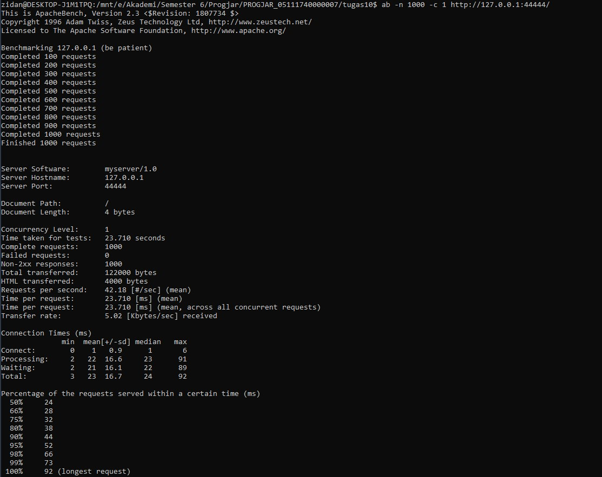
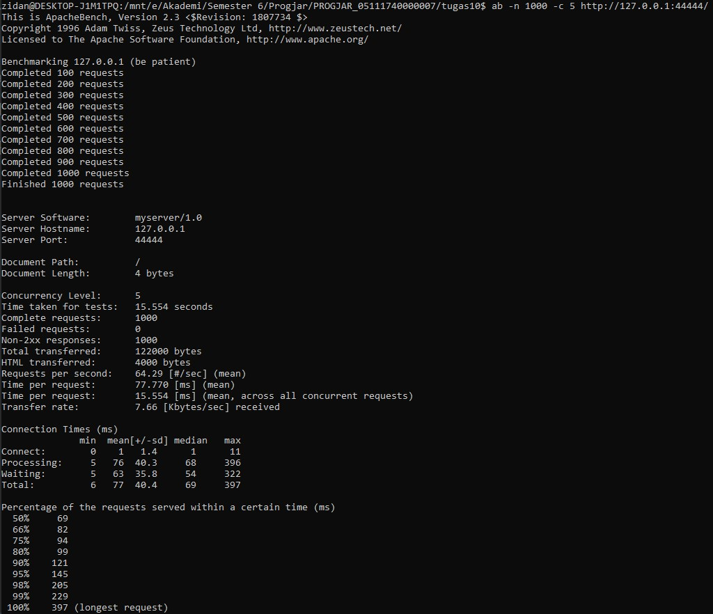
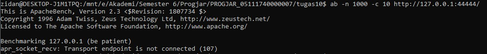
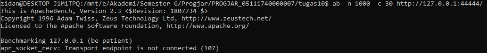
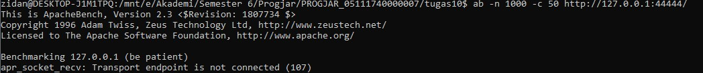
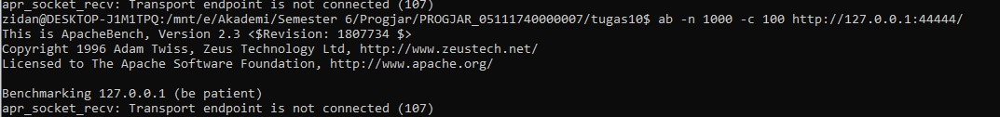

* server_thread_http.py
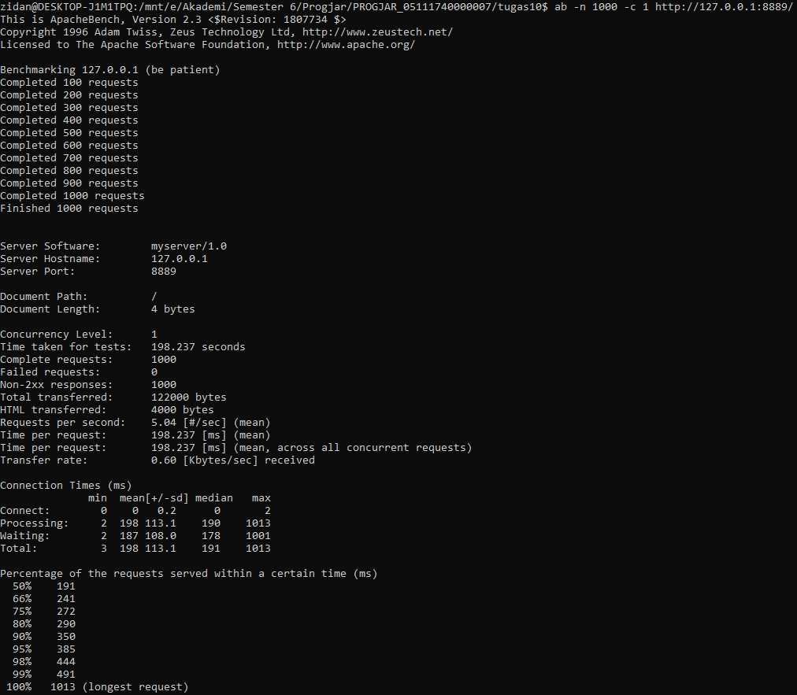
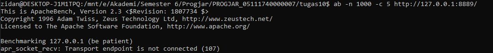
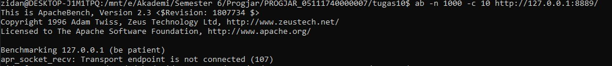
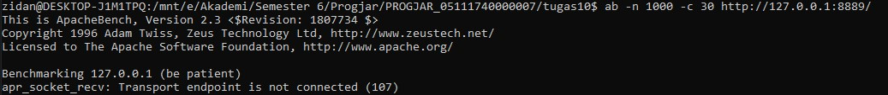
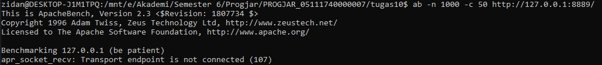
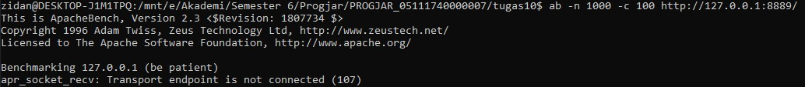
