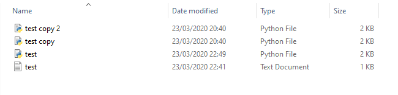
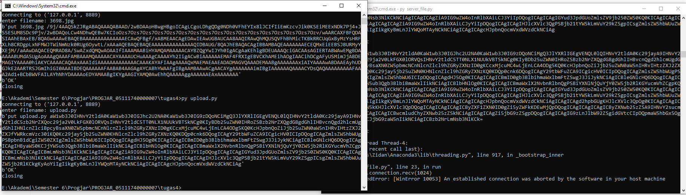
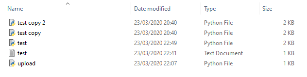
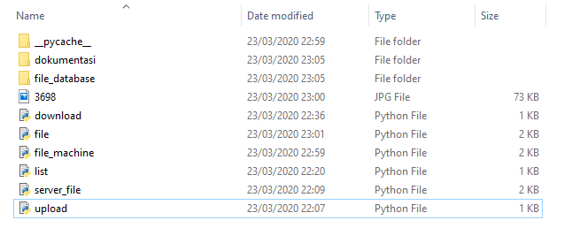
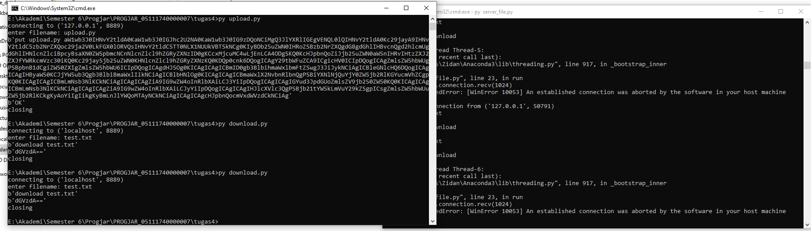
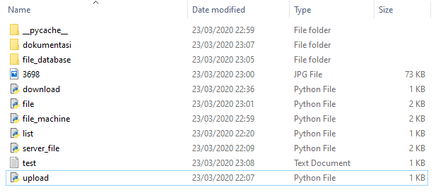
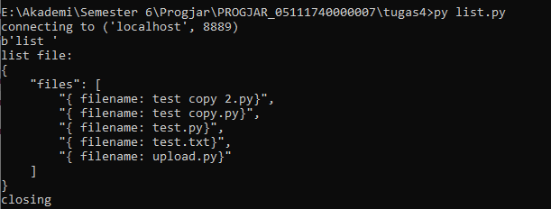

# Tugas Pemrograman Jaringan 4
## Dokumentasi Protokol

## Format Protokol
```
PROTOCOL FORMAT

string terbagi menjadi 2 bagian, dipisahkan oleh spasi
COMMAND spasi PARAMETER spasi PARAMETER ...

FITUR

- put : untuk upload file
  request : put
  parameter : filename
  response : berhasil -> ok
             gagal -> error

- download : untuk download file
  request: download
  parameter : filename
  response: berhasil -> OK
            gagal -> ERROR

- list : untuk melihat daftar file yang telah diupload
  request: list
  parameter: tidak ada
  response: list file yang telah diupload

- jika command tidak dikenali akan merespon dengan ERRCMD

```

## Menjalankan Server untuk menerima request dari client dan memberikan respon kepada client 
* Pertama, jalankan server.py kemudian jalankan masing-masing client

## Mengupload File

* Upload file upload.py dengan cara menjalankan upload.py sebagai berikut






* Maka file upload.py akan terupload ke direktori 'file_database' sebagai berikut



## Mendownload File
* Mendownload file test.txt dengan cara menjalankan download.py sebagai berikut





* Maka hasilnya sebagai berikut




## Melihat list file yang terdapat di direktori 'file_database'
* Melihat list file yang terdapat di direktori 'file_database' dalam format JSON dengan cara menjalankan list.py sebagai berikut

