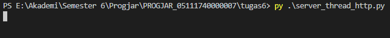
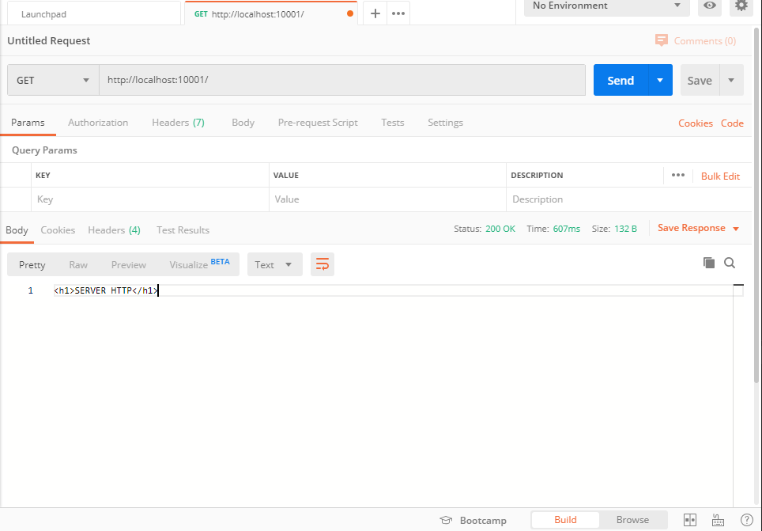
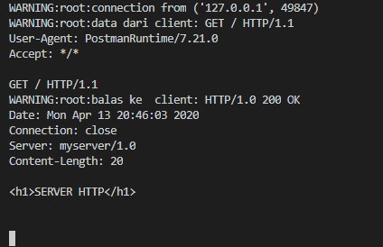
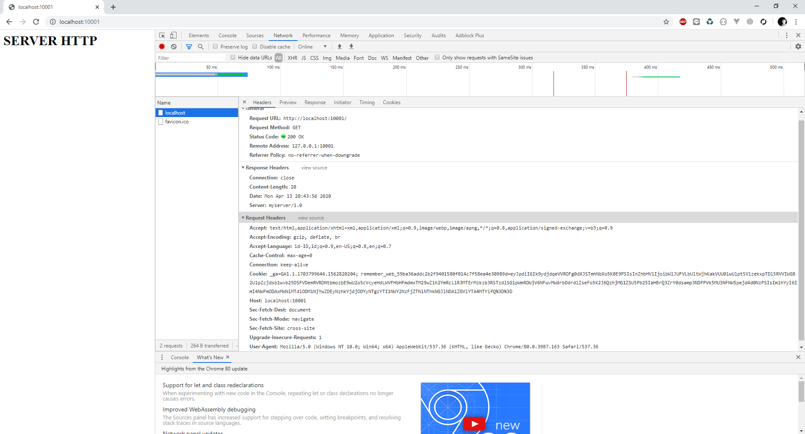
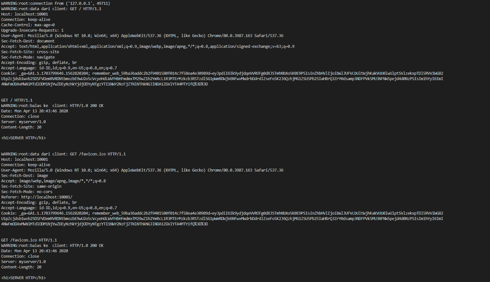

# Tugas Pemrograman Jaringan 6
## Dokumentasi

## Menjalankan Server 
* Pertama, jalankan server_thread_http.py

## Melakukan Request Melalui Postman
* Saya disini menggunakan postman karena telnet saya tidak bisa.

## Response Server Setelah Request Melalui Postman

## Melakukan Request Melalui Browser

## Response Server Setelah Request Melalui Chrome
