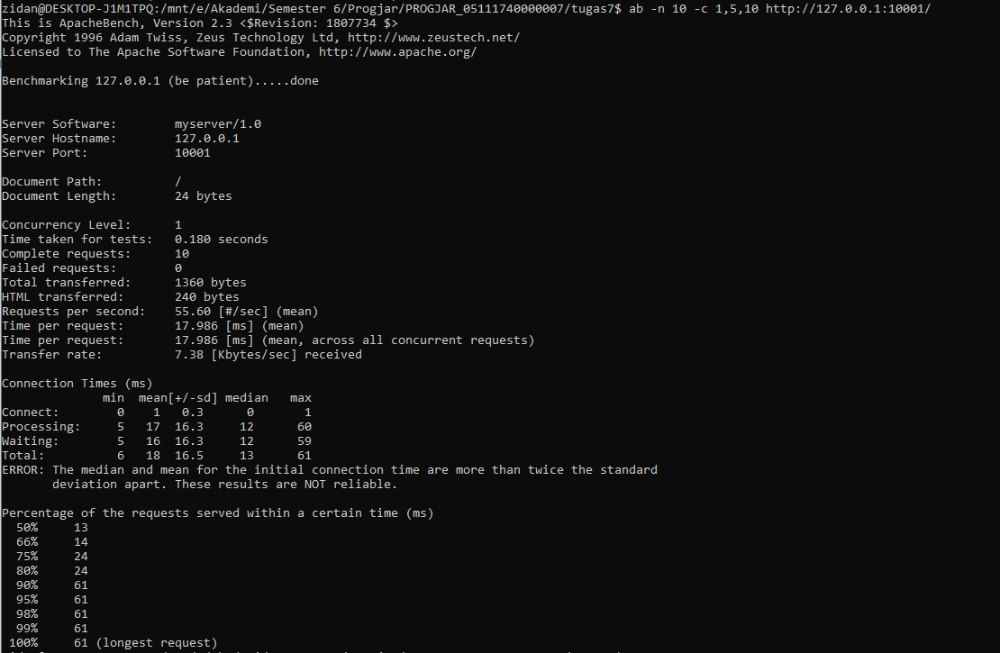
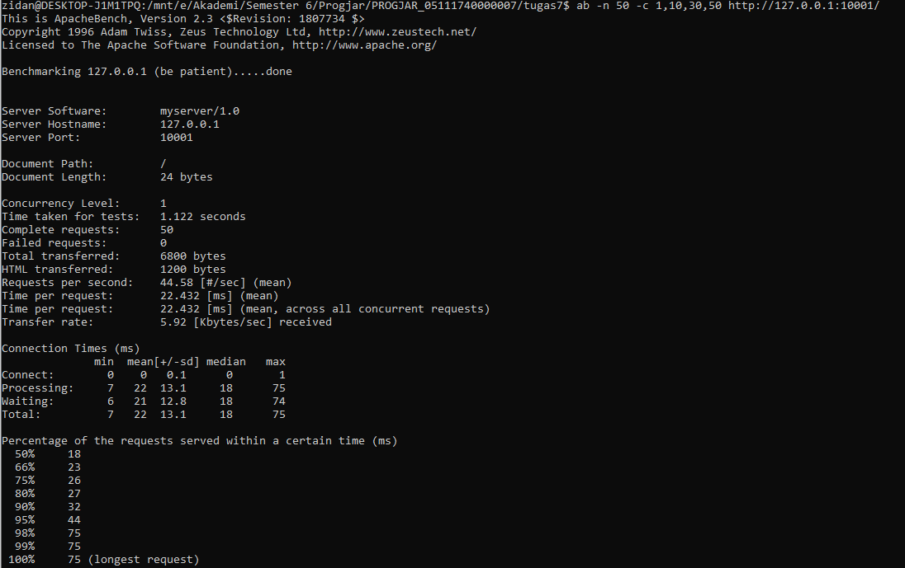
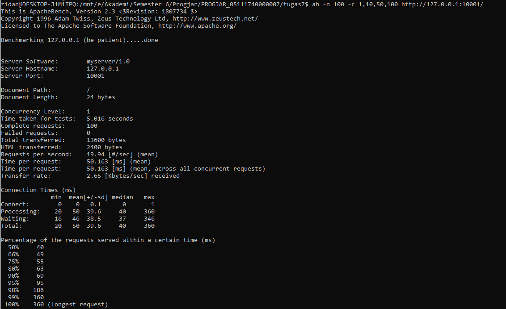

# Tugas Pemrograman Jaringan 6
## Dokumentasi

### Tabel Hasil Benchmark

| No test | Concurrency level | Time taken for test (seconds) | Complete request | Failed request | Total transferred (bytes) | Request per second | Time per request (ms) | Transfer rate (Kbytes/sec) |
|:-------:|:-----------------:|:-----------------------------:|:----------------:|:--------------:|:-------------------------:|:------------------:|:---------------------:|:--------------------------:|
|    1    |         1         |             0.180             |        10        |        0       |            1360           |        55.60       |         17.986        |            7.38            |
|    2    |         5         |               -               |        -         |        -       |             -             |          -         |           -           |              -             |
|    3    |         10        |               -               |        -         |        -       |             -             |          -         |           -           |              -             |
|    4    |         1         |             1.122             |        50        |        0       |            6800           |        44.58       |         22.432        |            5.92            |
|    5    |         10        |               -               |        -         |        -       |             -             |          -         |           -           |              -             |
|    6    |         30        |               -               |        -         |        -       |             -             |          -         |           -           |              -             |
|    7    |         50        |               -               |        -         |        -       |             -             |          -         |           -           |              -             |
|    8    |         1         |             5.016             |        100       |        0       |           13600           |        19.94       |         50.163        |            2.65            |
|    9    |         10        |               -               |        -         |        -       |             -             |          -         |           -           |              -             |
|    10   |         50        |               -               |        -         |        -       |             -             |          -         |           -           |              -             |
|    11   |         100       |               -               |        -         |        -       |             -             |          -         |           -           |              -             |

### Screenshot Benchmark
* 10 request dengan konkurensi 1

* 50 request dengan konkurensi 1

* 100 request dengan konkurensi 1

* Muncul error selain concurrency level 1