# Tugas Pemrograman Jaringan 9
## Dokumentasi

### Tabel Hasil Benchmark server_async_http.py

| No test | Concurrency level | Time taken for test (seconds) | Complete request | Failed request | Total transferred (bytes) | Request per second | Time per request (ms) | Transfer rate (Kbytes/sec) |
|:-------:|:-----------------:|:-----------------------------:|:----------------:|:--------------:|:-------------------------:|:------------------:|:---------------------:|:--------------------------:|
|    1    |         1         |             2.551             |       1000       |        0       |           122000          |       391.99       |          2.551        |           46.70            |
|    2    |         5         |             3.646             |       1000       |        0       |           122000          |       274.28       |          3.646        |           32.68            |
|    3    |         10        |               -               |        -         |        -       |             -             |          -         |           -           |              -             |
|    4    |         30        |               -               |        -         |        -       |             -             |          -         |           -           |              -             |
|    5    |         50        |               -               |        -         |        -       |             -             |          -         |           -           |              -             |
|    6    |         75        |               -               |        -         |        -       |             -             |          -         |           -           |              -             |
|    7    |         100       |               -               |        -         |        -       |             -             |          -         |           -           |              -             |

### Tabel Hasil Benchmark server_thread_http.py

| No test | Concurrency level | Time taken for test (seconds) | Complete request | Failed request | Total transferred (bytes) | Request per second | Time per request (ms) | Transfer rate (Kbytes/sec) |
|:-------:|:-----------------:|:-----------------------------:|:----------------:|:--------------:|:-------------------------:|:------------------:|:---------------------:|:--------------------------:|
|    1    |         1         |           223.991             |       1000       |        0       |           122000          |         4.46       |        223.991        |            0.53            |
|    2    |         5         |               -               |        -         |        -       |             -             |          -         |           -           |              -             |
|    3    |         10        |               -               |        -         |        -       |             -             |          -         |           -           |              -             |
|    4    |         30        |               -               |        -         |        -       |             -             |          -         |           -           |              -             |
|    5    |         50        |               -               |        -         |        -       |             -             |          -         |           -           |              -             |
|    6    |         75        |               -               |        -         |        -       |             -             |          -         |           -           |              -             |
|    7    |         100       |               -               |        -         |        -       |             -             |          -         |           -           |              -             |

### Screenshot Benchmark
* server_async_http.py
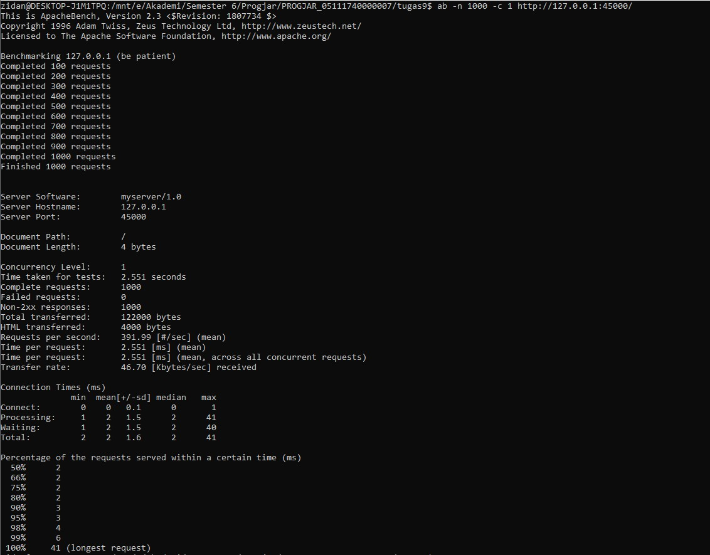
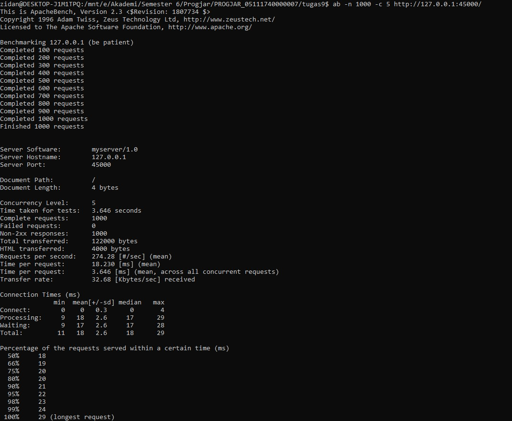
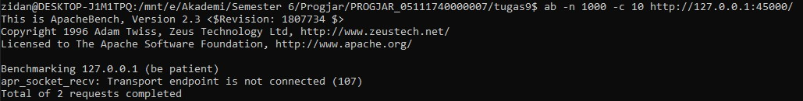
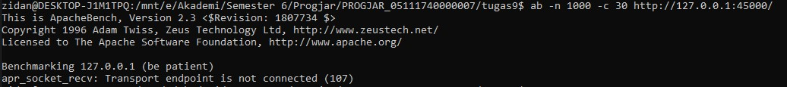

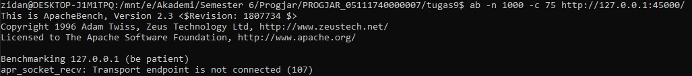
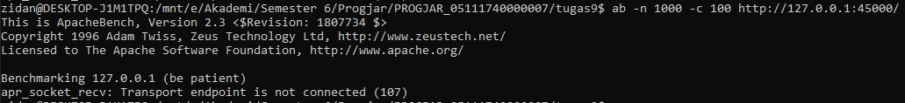

* server_thread_http.py
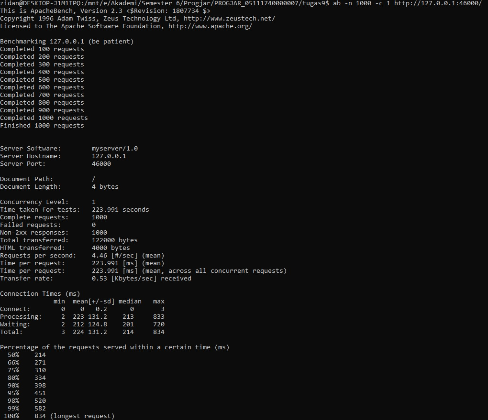
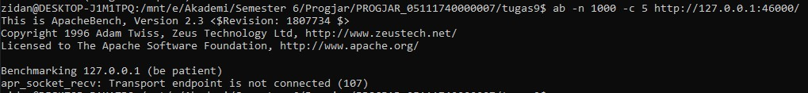
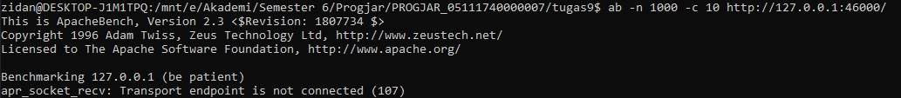
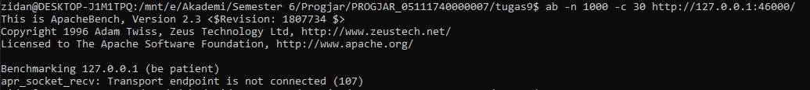
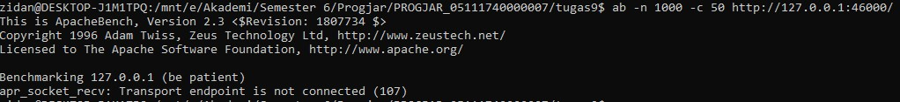
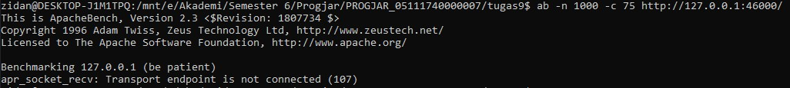
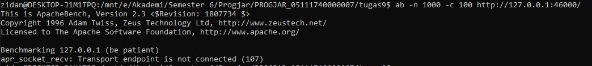
